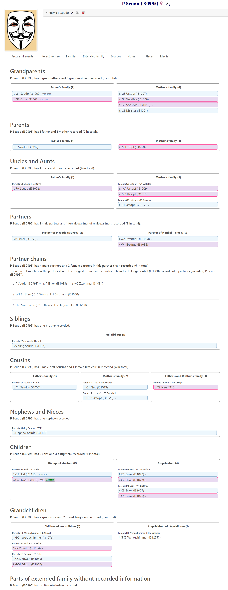
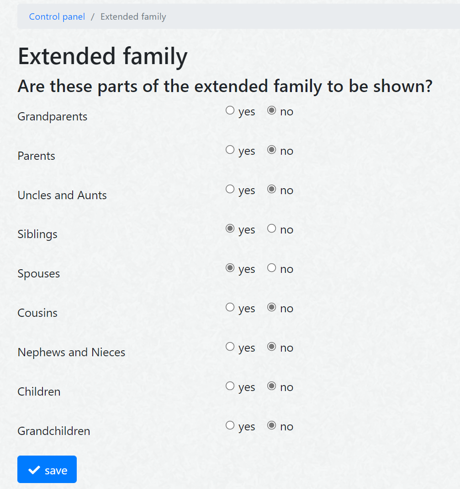

# webtrees module hh_extended_family

This [webtrees](https://www.webtrees.net) module creates an additional tab in the Individual view which lists the members of the core and the extended family of that person:
great-grandparents, grandparents, parents, parents-in-law, co-parents-in-law, uncles, aunts, partners, siblings, siblings-in-law, co-siblings-in-law, cousins, nephews, nieces, children, children-in-law, and grandchildren.

## Contents

This Readme contains the following main sections

* [Description](#description)
* [Screenshots](#screenshots)
* [Requirements](#requirements)
* [Installation](#installation)
* [Upgrade](#upgrade)
* [Translation](#translation)
* [Contact Support](#support)

* 
## Description

This module presents the core and the extended family of a proband. It is based on the [Eskimo kinship system](https://en.wikipedia.org/wiki/Kinship_terminology).

The user can filter the shown results by gender and dead/alive persons.

The admin can decide in the control panel 
* which extended family parts should be shown and in which sequence they should be presented
* if filter options should be presented for users
* how empty parts of extended family should be presented
* whether the name of proband is a full name or a short version
* whether a compact design should be used or an enriched version, showing a photo as well as complete birth and death information
* whether labels should be shown for each part of the extended family showing the generation shift and information about the related coefficient of relationship
* whether labels like "adopted child", "foster child", "triplet", "stillborn", or "linkage challenged" should be used to indicate special situations
  * GEDCOM records to indicate that a person
    * is e.g. a triplet, should look like "1 BIRT\n2 _ASSO @I123@\n3 RELA triplet" or "1 ASSO @I123@\n2 RELA triplet")
    * is stillborn or died as an infant, should look like "1 BIRT\n2 AGE STILLBORN" or "1 DEAT\n2 AGE INFANT"
    * has a special linkage status to the parent family (challenged, disproven, proven), should look like "1 FAMC @F123@\n2 STAT challenged"

The default presentation sequence of the extended family parts is oriented at the generation of the people in this part, relative to the proband
* great-grandparents                       // generation +3
* grandparents                             // generation +2
* uncles and aunts                         // generation +1
* uncles and aunts by marriage             // generation +1
* parents                                  // generation +1
* parents-in-law                           // generation +1
* co-parents-in-law                        // generation  0
* partners and partner chains              // generation  0
* siblings                                 // generation  0
* siblings-in-law                          // generation  0
* co-siblings-in-law			   // Generation  0
* cousins                                  // generation  0
* nephews and nieces                       // generation -1
* children                                 // generation -1
* children-in-law                          // generation -1
* grandchildren                            // generation -2

## Screenshots

Screenshot of tab using the compact design

Screenshot showing photo as well as birth and death information

Screenshot showing chain of partners (partner of partner of partner of ...)

Screenshot of control panel menu

## Requirements

This module requires **webtrees** version 2.0 or later.
This module has the same requirements as [webtrees#system-requirements](https://github.com/fisharebest/webtrees#system-requirements).

This module was tested with **webtrees** 2.0.16 version and all available themes.

## Installation

This section documents installation instructions for hh_cousins.

1. Make database backup
1. Download the [latest release](https://github.com/hartenthaler/hh_extended_family/releases/latest)
1. Unzip the package into your `webtrees/modules_v4` directory of your web server
1. Rename the folder to `hh_extended_family`
1. Login to **webtrees** as administrator, go to Control Panel/Modules/Individual page/Tabs, and find the module. It will be called "Extended family". Check if it has a tick for "Enabled".
1. Edit this entry to set the access level for each tree and to position the menu item to suit your preferences.
1. Finally, click SAVE, to complete the installation.

## Upgrade

To update simply replace the hh_extended_family files with the new ones from the latest download.

## Translation

You can help to translate this module. The language information is at the end of the file module.php.
The German part is the most actual and can be used as a base for your translation.
Use a local editor, like notepad++ to make the translations and send it back to me. You can do this via a pull request (if you know how) or by e-mail.
Updated translations will be included in the next release of this module.

There are now, beside English and German, translations to
* Chinese by @dust2k (under preparation)
* Czech by @jpretired
* Dutch by @TheDutchJewel
* Italian by @tonio (under preparation)
* Slovak by @ro-la
* Spanish by @yako1984
* Ukrainian by @z-yurets
* Vietnamese by @ngohuuthuan

## Contact Support

You can report errors raising an issue in this GitHub repository.

Forum: general webtrees support can be found at the [webtrees forum](http://www.webtrees.net/)

* * *
