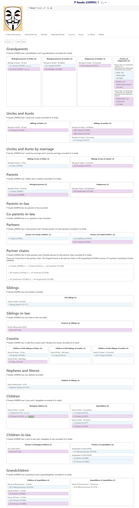
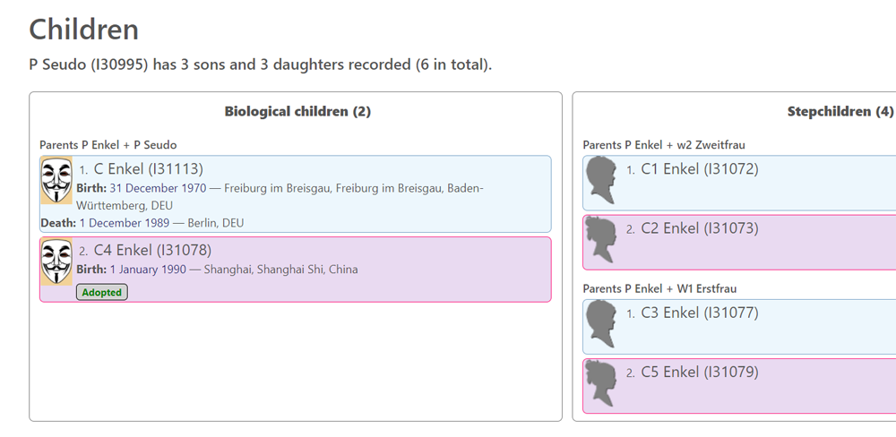
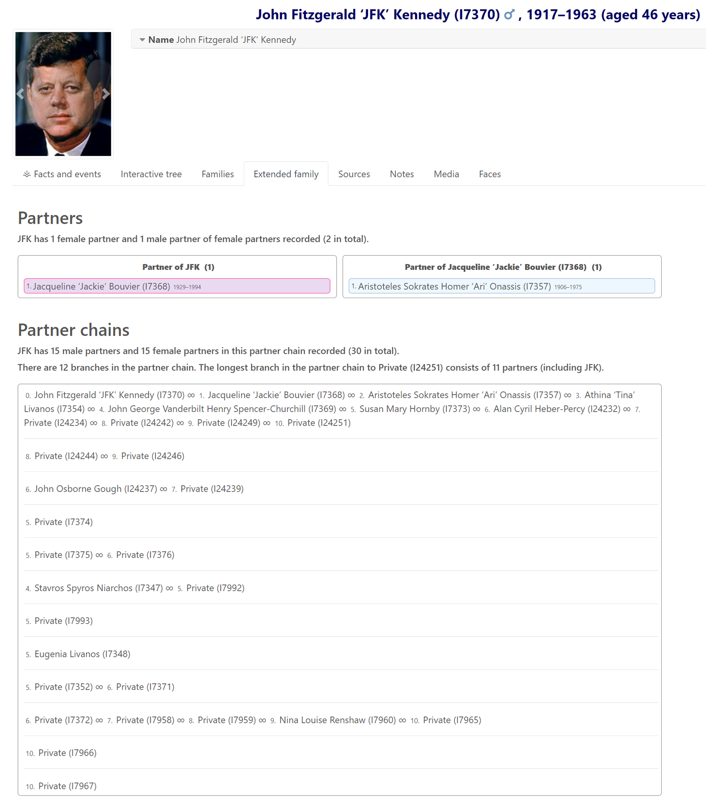
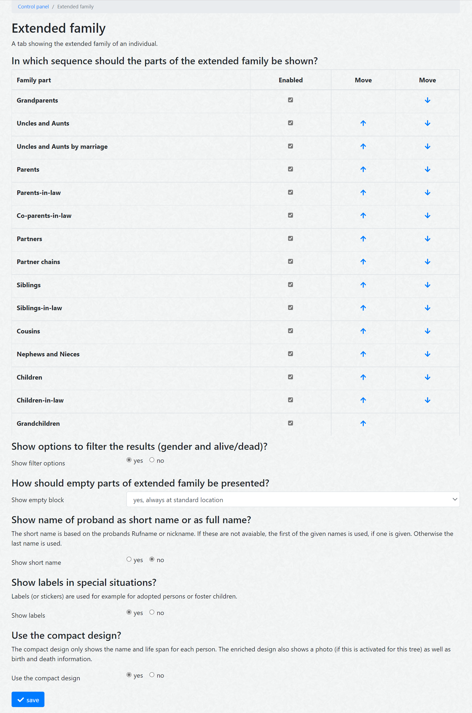

# 🌳 **webtrees** module for Extended Family (hh_extended_family)

This [webtrees](https://www.webtrees.net) custom module adds an **Extended family** tab to the individual page.
It shows the core and extended family of a selected person and lets site administrators decide which relationship groups are visible, in which order they are shown, and how much detail is displayed.

## 📚 Contents

This Readme contains the following main sections

* [Purpose](#Purpose)
* [Scope](#Scope)
* [Main features](#Features)
* [Family parts](#Family)
* [Configuration](#Configuration)
* [Architecture](#Architecture)
* [Screenshots](#Screenshots)
* [Requirements](#Requirements)
* [Installation](#Installation)
* [Upgrade](#Upgrade)
* [Translation](#Translation)
* [Support](#Support)
* [License](#License)

## 🎯 Purpose

The standard webtrees individual page focuses on a person's direct family context.
This module adds a broader relationship view that helps users understand the wider family network around a proband.

It is based on the [Eskimo kinship system](https://en.wikipedia.org/wiki/Kinship_terminology), which distinguishes the nuclear family from collateral relatives such as uncles, aunts, cousins, nephews, and nieces.

A German module description is available in the [webtrees manual at genealogy.net](https://wiki.genealogy.net/Webtrees_Handbuch/Anleitung_f%C3%BCr_Webmaster/Erweiterungsmodule/Gro%C3%9Ffamilie).

## 🔎 Scope

The module adds one individual-page tab named **Extended family**.
It does not create new GEDCOM records and it does not store relationship data in a separate database table.
Instead, it derives the shown family groups from the existing webtrees data.

The tab can show direct relatives, in-laws, relatives by marriage, partner chains, and descendant groups.
For parent-child links, GEDCOM `FAMC/PEDI` values are used where available, so biological, adoptive, foster, Rada, and step relationships can be kept separate in the affected family parts.
Users can optionally filter the visible relatives by

* sex or gender category
* living or deceased status

Administrators can decide whether these filter controls are shown to regular users.

## 💡 Main features

The module supports

* configurable family parts and display order
* compact and enriched layouts
* optional thumbnail, birth, and death information
* optional labels with generation shift and coefficient of relationship
* optional labels for special GEDCOM situations, such as adopted child, foster child, triplet, stillborn, infant death, and challenged linkage
* relationship grouping that distinguishes biological, social, and step relationships where the underlying GEDCOM data provides this information
* optional summary counts
* optional handling of partner chains
* optional "copy to clippings cart" action with support for huhwt-cce or the module's internal fallback action
* configurable handling of empty family parts
* full or shortened display name of the proband
* configurable place-name format in event boxes, including full place names, city-only display, and city plus ISO country code

Special labels are derived from GEDCOM patterns such as

* `1 BIRT / 2 _ASSO @I123@ / 3 RELA triplet`
* `1 ASSO @I123@ / 2 RELA triplet`
* `1 BIRT / 2 AGE STILLBORN`
* `1 DEAT / 2 AGE INFANT`
* `1 FAMC @F123@ / 2 STAT CHALLENGED`

## 👥 Family parts

The default presentation order is based on the generation shift relative to the proband.

* great-grandparents: generation +3
* grandparents: generation +2
* uncles and aunts: generation +1
* uncles and aunts by marriage: generation +1
* parents: generation +1
* parents-in-law: generation +1
* co-parents-in-law: generation 0
* partners and partner chains: generation 0
* siblings: generation 0
* siblings-in-law: generation 0
* co-siblings-in-law: generation 0
* cousins: generation 0
* nephews and nieces: generation -1
* children: generation -1
* children-in-law: generation -1
* grandchildren: generation -2
* great-grandchildren: generation -3
* grandchildren-in-law: generation -2

Every family part can be enabled, disabled, and reordered in the webtrees control panel.

## ⚙️ Configuration

Administrators can configure the module in the webtrees control panel under the individual-page tab modules.

The most important settings are

* which family parts are shown
* the order of the family parts
* whether user filter options are available
* whether empty family parts are hidden or shown
* whether summary counts are displayed
* whether partner chains count toward totals
* whether the compact or enriched design is used
* whether labels and relationship parameters are displayed
* how place names are displayed in event boxes
* whether the clippings cart action is available
* whether the clippings cart button uses huhwt-cce or the internal Extended Family action

If the clippings cart button is enabled and
[huhwt-cce](https://github.com/huhwt/huhwt-cce) is available, administrators can choose between the recommended huhwt-cce action and the internal Extended Family action.
If huhwt-cce is not available, the module uses its internal action and shows a warning in the control panel.
The internal action copies the currently selected filter variant to the standard webtrees clippings cart.

## 🧭 Architecture

The module is implemented as a webtrees custom tab module.
The calculation logic is separated from the presentation layer: `ExtendedFamilyTabModule` integrates with webtrees, `ExtendedFamily` builds the computed family view, and family-part classes under `src/Factory/ExtendedFamilyParts/` derive the individual relationship groups.

More details are documented in [docs/architecture.md](docs/architecture.md).

## 🖼 Screenshots

Compact tab design

Enriched design with photo, birth information, and death information

Partner chain view

Control panel settings

## 📌 Requirements

This module requires **webtrees** version 2.1 or later.
It has the same system requirements as [webtrees](https://github.com/fisharebest/webtrees#system-requirements).

To use the functions related to the clippings cart,
it is recommended to install the custom module
[clippings cart enhanced](https://github.com/huhwt/huhwt-cce).

The current module version is tested with **webtrees** 2.2.6,
all available themes, and all other custom modules.

The last version of this module for **webtrees** 2.0 is 2.0.16.58.

## 📥 Installation

Install and use [Custom Module Manager](https://github.com/Jefferson49/CustomModuleManager) for an easy and convenient installation of **webtrees** custom modules.
+ Open the Custom Module Manager view in **webtrees**
+ scroll to "Extended Family", and click on the "Install Module" button.

**Manual installation**:
1. Make a database backup.
1. Download the [latest release](https://github.com/Hartenthaler/hh_extended_family/releases/latest).
1. Unzip the package into the `webtrees/modules_v4` directory of your web server.
1. Rename the folder to `hh_extended_family`.
1. Login to **webtrees** as administrator.
1. Go to Control Panel / Modules / Individual page / Tabs.
1. Enable the module named **Extended family**.
1. Save the module settings.

## ⬆️ Upgrade

To update the module, replace the `hh_extended_family` files with the files from the latest release.

## 🌍 Translation

You can help translate this module.
The translation strings are stored as gettext files in `resources/lang/*.po`.
The German translation in `resources/lang/de.po` is usually the most complete version and can be used as the reference for new translations.

In version 3.9 of poedit.com the automatic recognition of strings in the source files does not work correctly.

Updated translations can be contributed by pull request or by e-mail.
They will be included in a future release of the module.

There are currently translations for

* Catalan by [@bernatbanyuls](https://github.com/bernatbanyuls)
* Chinese Simplified and Chinese Traditional by [@olor](https://github.com/olor) (=iyoua)
* Czech by [@jpretired](https://github.com/jpretired)
* Dutch by [@TheDutchJewel](https://github.com/TheDutchJewel)
* French by [@PalmyreSG1](https://github.com/PalmyreSG1), [@fa10175](https://github.com/fa10175), and [@geugeu1](https://github.com/geugeu1)
* German by [@Hartenthaler](https://github.com/Hartenthaler)
* Hindi by [@mrqd9](https://github.com/mrqd9)
* Norwegian Bokmål by [@eyolf](https://github.com/eyolf)
* Russian by [@aurbo](https://github.com/aurbo)
* Slovak by [@ro-la](https://github.com/ro-la)
* Spanish by [@yako1984](https://github.com/yako1984) and [@bernatbanyuls](https://github.com/bernatbanyuls)
* Swedish by Simon W
* Ukrainian by [@z-yurets](https://github.com/z-yurets)
* Vietnamese by [@ngohuuthuan](https://github.com/ngohuuthuan)

An Italian PO file exists, but it does not yet contain active translations.

## ❓ Support

* Issues: You can report errors by creating an issue in this GitHub repository.
* Feature requests: You can suggest improvements by creating an issue in this GitHub repository.
* Forum: General webtrees support can be found in the [webtrees forum](https://www.webtrees.net/).

## 📄 License

This module uses GPL-3.0-or-later as a license.

* Copyright (C) 2026 Hermann Hartenthaler
* Derived from **webtrees** - Copyright 2026 webtrees development team.

This program is free software: you can redistribute it and/or modify it
under the terms of the GNU General Public License as published by
the Free Software Foundation, either version 3 of the License, or
(at your option) any later version.

This program is distributed in the hope that it will be useful,
but WITHOUT ANY WARRANTY; without even the implied warranty of
MERCHANTABILITY or FITNESS FOR A PARTICULAR PURPOSE. See the
GNU General Public License for more details.
